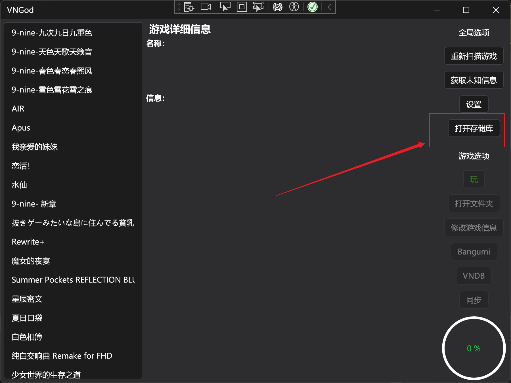
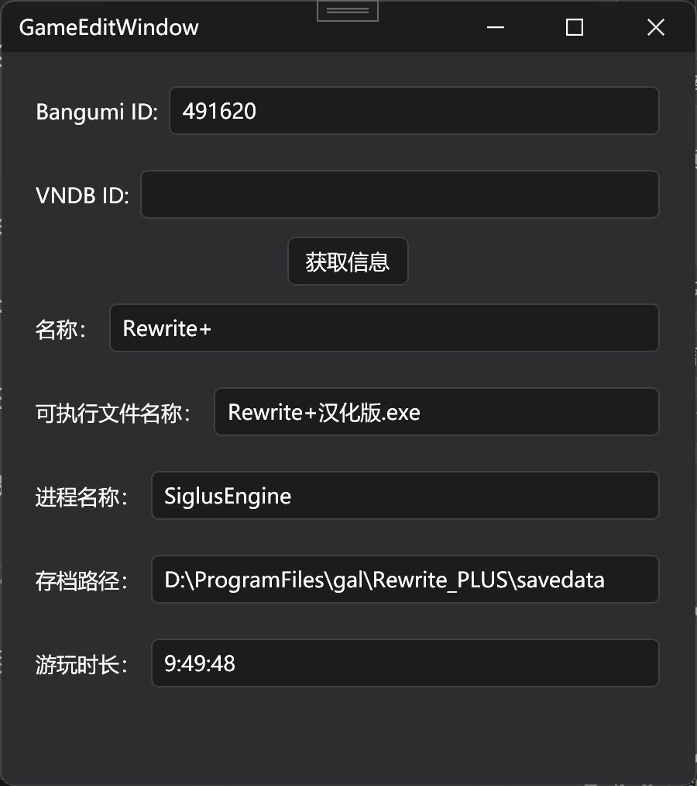

# VNGod

English | [中文](https://vngod.samhou.moe)

A visual novel manager, but simple and effective.


 [](https://github.com/SamHou0/VNGod/actions/workflows/dotnet-desktop.yml) 

> [!WARNING]
> This app is currently in development. Data loss during WebDAV sync may happen. Always backup your save from time to time if you choose to test it. Thanks for your participation!

> [!NOTE]
> This app is designed for Chinese users. So the default game display name is Chinese.

## Features

- [x] Organize your novels
- [x] Automatically match entries in:
  - [x] [Bangumi](https://bgm.tv)
  - [x] [vndb](https://vndb.org)
- [x] Open folder, game and entry page quickly
- [x] Record your playing time
- [x] Sync your saves and scanned files to WebDAV

## Quick Start Guide

1. Download the app zip from [Releases](https://github.com/SamHou0/VNGod/releases)
2. Extract to an empty that you like, then run `VNGod.exe`
3. Prepare your game folder like this:

```text
./gal (The name of the base folder does not matter)
├── 9-nine-九次九日九重色
├── 9-nine-天色天歌天籁音
├── 9-nine-春色春恋春熙风 Ver1.1
├── 9-nine-雪色雪花雪余痕
├── Air
├── Alpus and Dangerous Forest Ver.1.1
├── HappySistersLife
├── Koikatsu_Party
├── NUKITASHI
├── Rewrite_PLUS
├── SPRB
├── Sanoba Witch
├── StellarCode
├── Summer Pockets Ver2.1最终版
├── WHITE ALBUM
├── narcissu
├── nine_newEP
├── ましろ色シンフォニー -Love is pure white- Remake for FHD
├── オトメ世界の歩き方
├── 君与彼女与彼女之恋／你与彼女和彼女之恋（君と彼女と彼女の恋）
├── 圣女不死心
├── 恋爱猪脚饭
└── 神様ちゅ～ず！
```

> [!IMPORTANT]
> Each sub folder should only contain one game. Do not place multiple games within one folder.

> [!Tip]
> The sub folder's name should match the game that's inside it. This helps VNGod to identify it's translation name. (The language of the folder name does not matter.)

4. Choose the base folder by clicking `Open Repo` (in English)



5. (Optional) Configure your WebDAV and Bangumi Token in setting.

> [!TIP]
> Grab your Bangumi token at [https://next.bgm.tv/demo/access-token/create](https://next.bgm.tv/demo/access-token/create), and VNDB token at [vndb.org](https://vndb.org) > `My Profile` > `Applications` > `Create new token`.

> [!IMPORTANT]
> If no token configured or your Bangumi account does not fulfill the requirement to see nsfw contents, your R18 games may have wrong display name.

6. Click `Get missing Info` to scan games. If WebDAV configured, it will sync automatically.
7. Click `Edit Info` to edit games' info if it's wrong or missing. You can set a Bangumi ID and click `Get Info` to get the game's name automatically.


> [!NOTE]
> To use cloud save sync, find and set a save path. Make sure the path match on your different computers.

> [!CAUTION]
> NEVER start `VNGod` on MULTIPLE COMPUTERS to avoid data loss. To sync, close VNGod on one computer, then start another.

> [!WARNING]
> Considering how GalGames read files, we always recommend syncing saves before you run the game when playing on a new computer.

8. Click `Play` to start the game. Choose the game's executable. VNGod will hide when it starts, and shows when the game ends.

> [!IMPORTANT]
> If it hides and then shows at no time (when game does not exit), please use `taskmgr` to find the process name and configure it in `GameEditWindow`.

9. When the game exits, time played will be calculated.