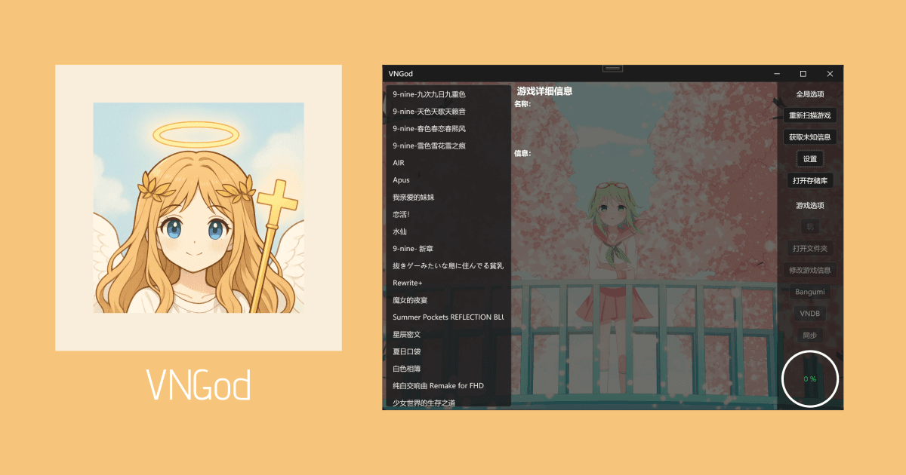

# 简介

简洁有用的视觉小说管理器。

> [!WARNING]
> 这个应用正在开发测试中，WebDAV 同步时，可能产生数据丢失。在你尝试它的存档云同步之前，先备份你的存档。感谢您参与本程序的测试！如果发现了任何问题，请[提出 Issue（用英语中文都可以）](https://github.com/SamHou0/VNGod/issues/new/choose)。

## 功能

- 统一管理你的视觉小说
- 自动匹配在线的条目，支持：
  - [Bangumi](https://bgm.tv)
  - [Vndb](https://vndb.org)
- 快速打开文件夹、游戏和上述条目页面
- 记录你的游玩时间
- 通过 WebDAV，同步扫描到的数据和游戏存档
