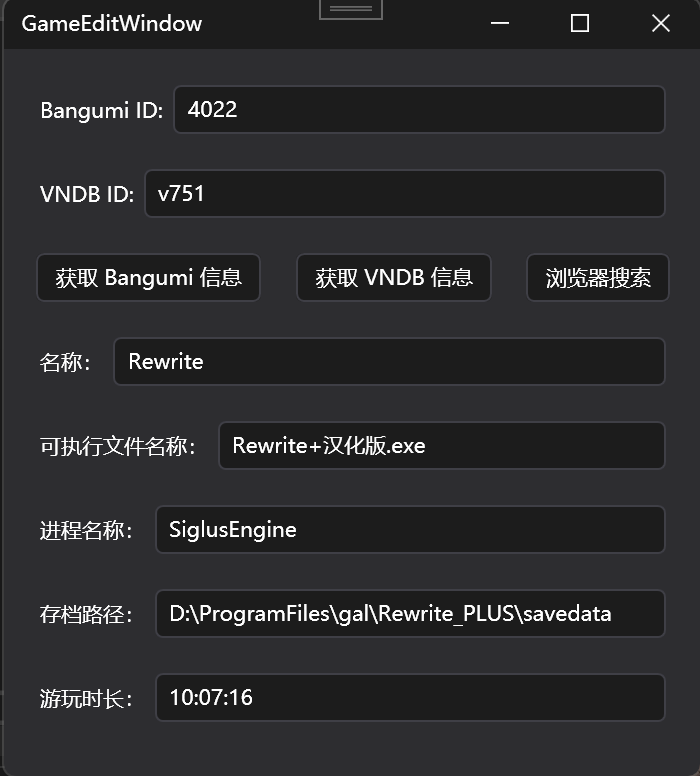

# 修改游戏信息

修改扫描到的游戏的信息。如果启用了 WebDAV，那么所有信息都会自动同步。

## Bangumi ID

输入 Bangumi 的编号。可在 URL 中找到。例如：`https://bgm.tv/subject/4022` 这个 URL 中，末尾的数字即为 ID。

## VNDB ID

输入 VNDB 的编号。可在 URL 中找到。例如：`https://vndb.org/v751` 末尾的 `v751`。

> [!IMPORTANT]
> `v` 这个字符是必要的，切勿去掉。

## 按钮

### 获取 Bangumi/VNDB 信息

根据上方输入框输入的 ID 信息，从 API 获取游戏的名称信息。

### 浏览器搜索

在浏览器中同时打开 Bangumi 和 VNDB 网页，用游戏的本地目录名作为查询的搜索词。可以使用这个功能，手动寻找匹配错误的游戏的 ID。

理论上来说，如果你浏览器已登录并且 VNGod 设定了 Token，第一个搜索结果和自动匹配的的搜索结果应该一致。

## 名称

游戏的中文名称。在自动匹配时，会从 VNDB 和 Bangumi 自动获取。手动编辑后，不会被覆盖。

## 可执行文件名称

用于启动游戏，输入可执行文件包含扩展名的完整文件名。该文件应位于当前游戏文件夹中，而不能处于文件夹的子文件夹中。

## 进程名称

从任务管理器中获取的进程名称。该项用于游戏计时，因此需要设定为游戏主进程的进程名称，而非启动进程的名称。

## 存档路径

输入存档的**完整路径**。不允许使用任何相对路径，必须使用绝对路径。
该项设置后，会立即启用当前游戏的存档云同步。必须先配置 WebDAV 凭据。存档云同步会在游戏启动和关闭时自动触发。存档将被压缩为压缩包上传云端。
如果需要多端同步，必须确保所有设备上存档的绝对路径相同。

## 游玩时长

以 `小时:分钟:秒` 格式的游玩时长。必须按照正确的格式输入，否则会自动重置为 0。
