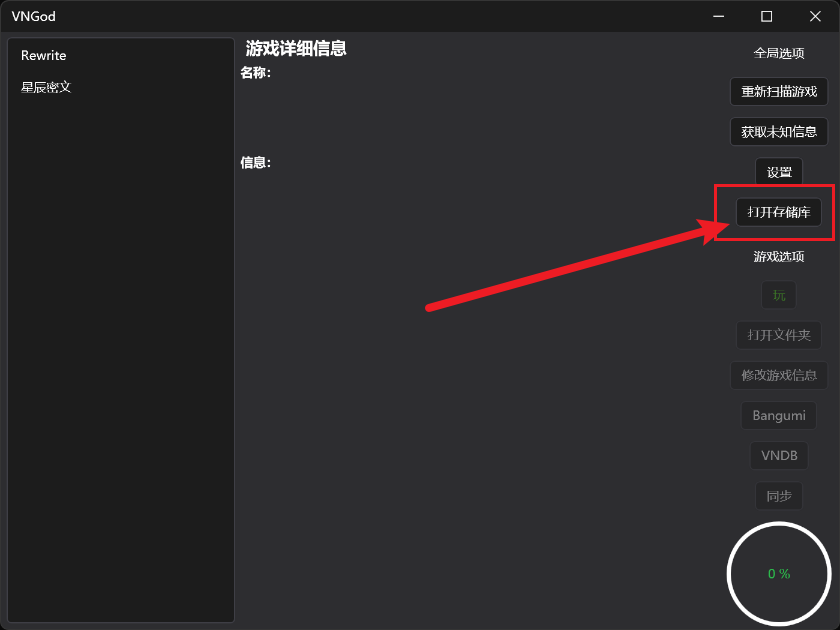
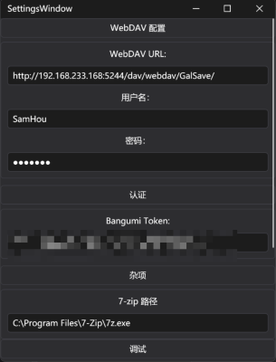

# 快速开始指南

从[下载页面](../download)中下载程序 ZIP 包

解压，然后运行 `VNGod.exe`。

准备好你的视觉小说游戏文件夹，像这样：

```text
./gal （这个根文件夹的名称并不重要）
├── 9-nine-九次九日九重色
├── 9-nine-天色天歌天籁音
├── 9-nine-春色春恋春熙风 Ver1.1
├── 9-nine-雪色雪花雪余痕
├── Air
├── Alpus and Dangerous Forest Ver.1.1
├── HappySistersLife
├── Koikatsu_Party
├── NUKITASHI
├── Rewrite_PLUS
├── SPRB
├── Sanoba Witch
├── StellarCode
├── Summer Pockets Ver2.1最终版
├── WHITE ALBUM
├── narcissu
├── nine_newEP
├── ましろ色シンフォニー -Love is pure white- Remake for FHD
├── オトメ世界の歩き方
├── 君与彼女与彼女之恋／你与彼女和彼女之恋（君と彼女と彼女の恋）
├── 圣女不死心
├── 恋爱猪脚饭
└── 神様ちゅ～ず！
```

> [!IMPORTANT]
> 每个子文件夹应该只包含一个游戏。别把多个游戏放到同一个文件夹中，也不要嵌套多层文件夹。

> [!Tip]
> 子文件夹的名称应该与其包含的游戏匹配。这能够帮助 VNGod 查询、识别其对应的条目（可以使用原名，或者规范的翻译名称）。

选择根文件夹，点击 `打开存储库`：



（非必要）在设置中，配置你的 WebDAV，Bangumi Token，并指定 7-zip 的 `7z.exe` 可执行文件的路径（请参阅[游戏存储](../feature/game-store)，了解更多信息）。如果配置无效，关闭设置界面后会提示错误，此时请根据错误提示来修改设置。如果不改正，那么相应的功能会无法使用。下面是一个示例配置：



> [!TIP]
> 获取 Bangumi token，请转到 [https://next.bgm.tv/demo/access-token/create](https://next.bgm.tv/demo/access-token/create)。

> [!IMPORTANT]
> 如果你没有配置，或者你的 Bangumi 账号不满足查看 NSFW 条目的条件，那么你的相应游戏会识别错误或异常。

程序会自动搜索子文件夹。然后，点击 `获取未知信息` 来识别游戏。如果你已经配置了 WebDAV，那么扫描到的数据会同步。

点击 `修改游戏信息` 来编辑识别错误或失败的游戏的信息。你可以设置 Bangumi ID 或者 VNDB ID，然后点击相应的按钮，自动获得游戏的中文翻译名称。

> [!NOTE]
> 要使用存档云同步，先寻找存档路径，并填入。确保多台电脑上的路径一致。

> [!CAUTION]
> 绝对不要在**多台电脑**上启动 `VNGod`。要同步数据，先关闭，再在另一台电脑上运行。

> [!WARNING]
> 考虑到视觉小说读取文件和创建存档的方式，我们强烈建议您，在新电脑上游玩同一游戏时，先同步存档，再运行游戏，防止新的存档覆盖您的旧存档。

点击 `玩`，启动游戏。选择游戏的可执行文件。VNGod 在游戏启动时会自动隐藏，在游戏结束时，会自动显示。

> [!IMPORTANT]
> 如果 VNGod 隐藏后，马上显示（此时游戏未退出），那么请在任务管理器里，寻找游戏的进程名称，然后填入修改游戏信息的窗口。（已知某些游戏链式启动较慢，即使这样配置仍然不行，请先检查游戏是否在第一次运行破解或激活的脚本。通常执行一次后，就能正常启动）

当游戏退出后，游戏时间会自动计算。存档和数据也将同步。
